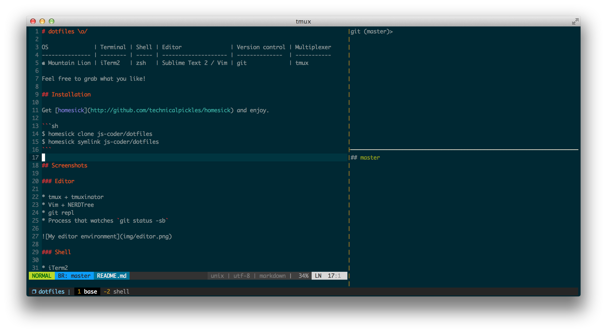

# dotfiles \o/

OS                | Terminal | Shell | Editor               | Version control | Multiplexer
------------------| ---------| ------| ---------------------| ----------------| -----------
 El Capitan      | iTerm2   | zsh   |  Vim                 | git             | tmux

Feel free to grab what you like!

## Installation

First you'll need to clone the repo

```sh
$ git clone https://github.com/florian/dotfiles.git ~/.dotfiles && cd ~/.dotfiles
```

Next you'll need to symlink the dotfiles that you want to use. I personally use [GNU Stow](https://www.gnu.org/software/stow/) for that and it works really well.

```sh
$ stow -t ~ git tmux vim zsh ruby
```

There's a billion other symlink managers and you can probably use many of them for these dotfiles as well, I used [homesick](https://github.com/technicalpickles/homesick) before.

Afterwards:

1. Install [homebrew](https://brew.sh/)
2. Set zsh as the default shell:
```sh
$ chsh -s /bin/zsh
```
3. Install more dependencies:
```sh
$ mkcd .zshstore
$ git clone https://github.com/zsh-users/zsh-syntax-highlighting
$ git clone https://github.com/zsh-users/zsh-autosuggestions
$ git clone https://github.com/rupa/z
```
4. Change the [iTerm color scheme](http://iterm2colorschemes.com/)
5. Install [Vundle](https://github.com/VundleVim/Vundle.vim#quick-start)
6. Open Vim and run `:PluginInstall`

## Screenshots

### Editor

* tmux + tmuxinator
* Vim + NERDTree
* git repl
* Process that watches `git status -sb`



### Shell

* iTerm2
* Dark / light [solarized](http://ethanschoonover.com/solarized) theme
* Custom `$PROMPT`
* zsh-syntax-highlighting plugin


## Stuff you might not know

- [antigen](https://github.com/zsh-users/antigen) – A plugin manager for zsh.
- [vundle](https://github.com/gmarik/vundle) – A plugin manager for Vim.
- [vimpager](https://github.com/rkitover/vimpager) – Vim as a `$PAGER`
- [vimcat](https://github.com/ofavre/vimcat) – cat with Vim's syntax
  highlighting

## Inspiration

- [Sirupsen/dotfiles](https://github.com/Sirupsen/dotfiles)
- [holman/dotfiles](https://github.com/holman/dotfiles)
- [aziz/dotfiles](https://github.com/aziz/dotfiles)
- [jweslley/dotfiles](https://github.com/jweslley/dotfiles)
- [linduxed/dotfiles](https://github.com/linduxed/dotfiles)
- [adamyonk/dotfiles](https://github.com/adamyonk/dotfiles)
